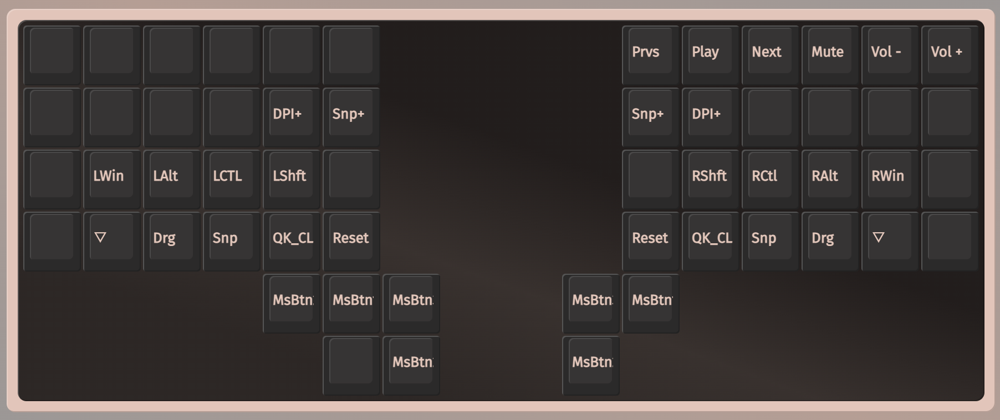

# Charybdis


## QMK customization

Since I touch the trackball a lot while typing (and this is visually annoying),
I decided to make a small change to the original QMK firmware to disable
the trackball in all layers except the pointer layer.

If you want to try it, clone my fork and compile it:

```sh
git clone https://github.com/tommyblue/qmk_firmware.git
cd qmk_firmware
qmk setup // ensure you're setting my fork as qmk homee
qmk compile -kb bastardkb/charybdis/4x6/v2/splinky_3 -km via
```

Then copy the compiled files to both the sides of the keyboard.

If you want to apply the patch also to other keyboard versions (3x5 and 3x6)
check the [relevant commit](https://github.com/tommyblue/qmk_firmware/commit/27d259a069ae07bc2e01b9eddcb9ab6ca4bb68b4) and apply the code there.

## Layout

To download a layout for [VIA](https://www.caniusevia.com/), check the [layouts folder](./layouts/)

### Layer 0


### Layer 1


### Layer 2


### Layer 3


